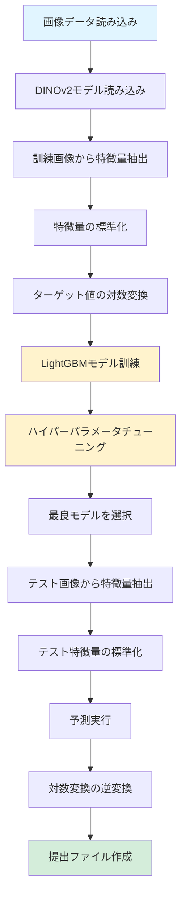

# CSIRO Biomass予測コード - 初学者向け解説

## 目次
1. [イントロダクション](#イントロダクション)
2. [各セルの詳細解説](#各セルの詳細解説)
3. [用語集](#用語集)
4. [コードの実行フロー](#コードの実行フロー)
5. [補足情報](#補足情報)

---

## イントロダクション

### このコードの目的

このコードは、**CSIRO Biomassコンペティション**用の機械学習パイプラインです。具体的には、**植物の画像からバイオマス（植物の乾燥重量）を予測する**タスクを実行します。

### 予測する5つのターゲット

1. **Dry_Green_g**: 緑色の乾燥バイオマス（グラム）
2. **Dry_Dead_g**: 枯れた部分の乾燥バイオマス（グラム）
3. **Dry_Clover_g**: クローバーの乾燥バイオマス（グラム）
4. **GDM_g**: 地上部乾燥重量（グラム）
5. **Dry_Total_g**: 総乾燥バイオマス（グラム）← **最も重要（重み0.5）**

### 使用する技術スタック

このコードでは、以下の技術を組み合わせて使用しています：

- **深層学習（Deep Learning）**
  - PyTorch: 深層学習フレームワーク
  - DINOv2: 画像から特徴量を抽出する事前学習済みモデル
  - Transformers: モデルを読み込むためのライブラリ

- **機械学習（Machine Learning）**
  - LightGBM: 高速で高精度な勾配ブースティングアルゴリズム
  - scikit-learn: データ前処理、モデル評価、交差検証などのツール

- **データ処理**
  - NumPy: 数値計算
  - Pandas: データフレーム操作
  - PIL: 画像処理

### 全体の処理フロー

このコードは、以下のような流れで動作します：

```
1. 画像データを読み込む
   ↓
2. DINOv2モデルで画像から特徴量を抽出（転移学習）
   ↓
3. 抽出した特徴量を標準化（前処理）
   ↓
4. LightGBMモデルで訓練（ハイパーパラメータチューニング付き）
   ↓
5. テストデータで予測
   ↓
6. 提出用CSVファイルを作成
```

---

## 各セルの詳細解説

### Cell 0: ライブラリのインポート

```python
import numpy as np
import pandas as pd
import os
from pathlib import Path
from tqdm import tqdm

import lightgbm as lgb
from lightgbm import LGBMRegressor
from sklearn.preprocessing import StandardScaler
from sklearn.model_selection import GridSearchCV, KFold
from sklearn.metrics import make_scorer
from sklearn.multioutput import MultiOutputRegressor

import torch
from torch.utils.data import DataLoader
import torchvision.transforms as T
from PIL import Image
from transformers import AutoModel
```

#### 各ライブラリの役割

**データ処理系**
- `numpy` (np): 数値計算や配列操作を行う
- `pandas` (pd): データフレーム（表形式のデータ）を扱う
- `pathlib.Path`: ファイルパスを扱いやすくする
- `tqdm`: 処理の進捗を表示する（プログレスバー）

**機械学習系**
- `lightgbm`: 高速な勾配ブースティングアルゴリズム
- `sklearn.preprocessing.StandardScaler`: データを標準化（平均0、分散1に変換）
- `sklearn.model_selection.GridSearchCV`: ハイパーパラメータを自動で探索
- `sklearn.model_selection.KFold`: 交差検証（データを分割して評価）
- `sklearn.metrics.make_scorer`: カスタム評価指標を作成
- `sklearn.multioutput.MultiOutputRegressor`: 複数のターゲットを同時に予測

**深層学習系**
- `torch`: PyTorchのメインライブラリ
- `torchvision.transforms`: 画像の前処理（リサイズ、正規化など）
- `PIL.Image`: 画像を読み込む
- `transformers.AutoModel`: 事前学習済みモデルを読み込む

---

### Cell 1: 評価指標の定義

```python
TARGETS = ['Dry_Green_g', 'Dry_Dead_g', 'Dry_Clover_g', 'GDM_g', 'Dry_Total_g']
WEIGHTS = np.array([0.1, 0.1, 0.1, 0.2, 0.5])

def weighted_r2_metric(y_true, y_pred):
    ss_res = np.sum(WEIGHTS * np.sum((y_true - y_pred)**2, axis=0))
    global_mean = np.average(np.mean(y_true, axis=0), weights=WEIGHTS)
    ss_tot = np.sum(WEIGHTS * np.sum((y_true - global_mean)**2, axis=0))
    return 1 - (ss_res / ss_tot)

weighted_scorer = make_scorer(weighted_r2_metric, greater_is_better=True)
```

#### 重み付きR²スコアとは？

**R²スコア（決定係数）**は、モデルの予測精度を測る指標です。1に近いほど良い予測を意味します。

通常のR²スコアは、すべてのターゲットを平等に扱いますが、このコンペティションでは**Dry_Total_g（総乾燥バイオマス）が最も重要**とされています。そのため、重みを使って重要度を調整しています。

#### 重みの意味

```python
WEIGHTS = np.array([0.1, 0.1, 0.1, 0.2, 0.5])
```

- Dry_Green_g: 重み 0.1（10%）
- Dry_Dead_g: 重み 0.1（10%）
- Dry_Clover_g: 重み 0.1（10%）
- GDM_g: 重み 0.2（20%）
- **Dry_Total_g: 重み 0.5（50%）** ← 最も重要

合計は1.0になります。

#### 関数の動作

1. `ss_res`: 残差平方和（予測値と実際の値の差の二乗和）
2. `global_mean`: 全体の平均値（重み付き）
3. `ss_tot`: 総平方和（実際の値と平均値の差の二乗和）
4. `1 - (ss_res / ss_tot)`: R²スコアを計算

重みをかけることで、重要なターゲット（Dry_Total_g）の予測精度が全体のスコアに大きく影響するようになります。

---

### Cell 2: 特徴抽出関数

```python
MEAN = [0.485, 0.456, 0.406]
STD  = [0.229, 0.224, 0.225]

@torch.no_grad()
def extract_dense_features(df, model, device, base_path):
    """TTA 提取 dense 特征 -> DataFrame"""
    tta_transforms = [
        T.Compose([T.Resize(256), T.CenterCrop(224), T.ToTensor(), T.Normalize(MEAN, STD)]),
        T.Compose([T.Resize(256), T.CenterCrop(224), T.RandomHorizontalFlip(p=1.0), T.ToTensor(), T.Normalize(MEAN, STD)])
    ]
    unique_paths = df['image_path'].unique()
    all_feats = []
    for path in tqdm(unique_paths, desc="GPU Feature Extraction"):
        img = Image.open(base_path / path).convert("RGB")
        tta_results = [
            model(aug(img).unsqueeze(0).to(device)).last_hidden_state[:, 1:, :].mean(dim=1).cpu().numpy()
            for aug in tta_transforms
        ]
        all_feats.append(np.mean(tta_results, axis=0))
    feat_matrix = np.vstack(all_feats)
    feat_cols = [f"feat_{i}" for i in range(feat_matrix.shape[1])]
    return pd.DataFrame(feat_matrix, columns=feat_cols), unique_paths
```

#### DINOv2とは？

**DINOv2**は、Meta（旧Facebook）が開発した自己教師あり学習モデルです。大量の画像データで事前学習されており、画像から高品質な特徴量を抽出できます。

このコードでは、DINOv2を**特徴抽出器**として使用します。つまり、画像を数値のベクトル（特徴量）に変換する役割を担います。

#### TTA（Test Time Augmentation）とは？

**TTA**は、予測の精度を向上させるテクニックです。同じ画像を複数の方法で変換（拡張）し、それぞれで予測を行い、その平均を取ることで、より安定した予測が可能になります。

このコードでは、2つの変換を使用しています：
1. **通常の画像**: リサイズ→中央クロップ→正規化
2. **水平フリップ**: 上記に加えて左右反転

#### 関数の動作ステップ

1. **画像の前処理を定義**
   - `MEAN`と`STD`: ImageNetデータセットで標準的に使われる正規化パラメータ
   - リサイズ（256×256）→中央クロップ（224×224）→テンソル化→正規化

2. **各画像について処理**
   - 画像を読み込む（RGB形式に変換）
   - 2つの変換（通常とフリップ）を適用
   - DINOv2モデルで特徴量を抽出
   - 2つの結果の平均を取る

3. **結果をDataFrameに変換**
   - すべての特徴量を行列にまとめる
   - 列名を`feat_0`, `feat_1`, ... と命名

#### `@torch.no_grad()`デコレータ

このデコレータは、勾配計算を無効にします。予測時には勾配は不要なので、メモリを節約し、処理速度を向上させます。

---

### Cell 3: データ準備と前処理

```python
device = torch.device("cuda" if torch.cuda.is_available() else "cpu")
base_path = Path("/kaggle/input/csiro-biomass")
model_dir = os.path.abspath("/kaggle/input/dinov2/pytorch/large/1")

model = AutoModel.from_pretrained(
    model_dir, local_files_only=True, trust_remote_code=True
).to(device).eval()

train_df = pd.read_csv(base_path / "train.csv")
train_p = train_df.pivot_table(
    index="image_path", columns="target_name", values="target"
).reset_index()
X_train_df, _ = extract_dense_features(train_p, model, device, base_path)
Y_train_log = np.log1p(train_p[TARGETS].values)

scaler = StandardScaler()
X_train_scaled = pd.DataFrame(
    scaler.fit_transform(X_train_df), columns=X_train_df.columns
)
```

#### ステップ1: デバイスの設定

```python
device = torch.device("cuda" if torch.cuda.is_available() else "cpu")
```

- GPU（CUDA）が利用可能ならGPUを使用、なければCPUを使用
- GPUを使うと処理が大幅に高速化されます

#### ステップ2: DINOv2モデルの読み込み

```python
model = AutoModel.from_pretrained(...).to(device).eval()
```

- `from_pretrained`: 事前学習済みモデルを読み込む
- `.to(device)`: モデルをGPUまたはCPUに移動
- `.eval()`: 評価モードに設定（ドロップアウトなどを無効化）

#### ステップ3: 訓練データの読み込みと整形

```python
train_df = pd.read_csv(base_path / "train.csv")
train_p = train_df.pivot_table(
    index="image_path", columns="target_name", values="target"
).reset_index()
```

**ピボットテーブル**とは、データを行列形式に変換する操作です。

**変換前（train_df）**:
```
image_path    target_name    target
image1.jpg    Dry_Green_g    10.5
image1.jpg    Dry_Dead_g     5.2
image2.jpg    Dry_Green_g    8.3
...
```

**変換後（train_p）**:
```
image_path    Dry_Green_g    Dry_Dead_g    Dry_Clover_g    ...
image1.jpg    10.5           5.2           2.1            ...
image2.jpg    8.3            4.1           1.8            ...
...
```

#### ステップ4: 特徴量の抽出

```python
X_train_df, _ = extract_dense_features(train_p, model, device, base_path)
```

- 訓練画像からDINOv2で特徴量を抽出
- `X_train_df`: 特徴量のDataFrame（説明変数）

#### ステップ5: ターゲット値の対数変換

```python
Y_train_log = np.log1p(train_p[TARGETS].values)
```

**`log1p`とは？**
- `log1p(x) = log(1 + x)`
- バイオマスの値は0以上で、大きな値の範囲を持つことが多い
- 対数変換することで、値の分布を正規分布に近づける
- これにより、モデルの学習が安定し、精度が向上する

**なぜ`log1p`を使うのか？**
- `log(0)`は定義できないが、`log1p(0) = log(1) = 0`なので、0の値も扱える
- 小さい値でも精度が保たれる

#### ステップ6: 特徴量の標準化

```python
scaler = StandardScaler()
X_train_scaled = scaler.fit_transform(X_train_df)
```

**標準化とは？**
- 各特徴量の平均を0、標準偏差を1に変換する処理
- 式: `(値 - 平均) / 標準偏差`

**なぜ標準化するのか？**
- 特徴量のスケール（大きさ）が異なると、モデルの学習が不安定になる
- すべての特徴量を同じスケールにすることで、学習が効率的になる

**`fit_transform`とは？**
- `fit`: 平均と標準偏差を計算（訓練データから学習）
- `transform`: 実際に変換を適用

---

### Cell 4: モデル訓練とハイパーパラメータチューニング

```python
param_grid = {
    "estimator__learning_rate": [0.05, 0.1],
    "estimator__num_leaves": [31, 63],
    "estimator__n_estimators": [100, 200],
    "estimator__random_state": [42]
}
base_lgbm = MultiOutputRegressor(LGBMRegressor(verbosity=-1))
grid_search = GridSearchCV(
    base_lgbm,
    param_grid,
    cv=KFold(n_splits=5, shuffle=True, random_state=42),
    scoring=weighted_scorer,
    n_jobs=-1,
    verbose=0
)
grid_search.fit(X_train_scaled, Y_train_log)
```

#### LightGBMとは？

**LightGBM**は、Microsoftが開発した勾配ブースティングアルゴリズムです。

**特徴:**
- 高速で高精度
- メモリ使用量が少ない
- 大規模データに強い

**勾配ブースティングとは？**
- 複数の弱い学習器（決定木）を順番に組み合わせて、強力なモデルを作る手法
- 前の学習器の誤差を次の学習器が修正していく

#### MultiOutputRegressorとは？

通常の回帰モデルは1つのターゲットしか予測できませんが、このコンペティションでは5つのターゲットを同時に予測する必要があります。

**MultiOutputRegressor**は、各ターゲットに対して独立したモデルを訓練し、同時に予測できるようにするラッパーです。

#### ハイパーパラメータとは？

**ハイパーパラメータ**は、モデルの動作を制御する設定値です。データから学習されるパラメータ（重みなど）とは異なり、人間が設定する必要があります。

このコードで調整しているハイパーパラメータ：

1. **`learning_rate`** (学習率): [0.05, 0.1]
   - モデルが学習する速さを制御
   - 小さい値: ゆっくり学習（時間がかかるが精度が高い可能性）
   - 大きい値: 速く学習（早いが過学習のリスク）

2. **`num_leaves`** (葉の数): [31, 63]
   - 決定木の複雑さを制御
   - 多いほど複雑なパターンを学習できるが、過学習のリスクも増える

3. **`n_estimators`** (木の数): [100, 200]
   - 使用する決定木の数
   - 多いほど精度が上がる可能性があるが、計算時間も増える

4. **`random_state`**: [42]
   - 乱数のシード（再現性のため）

#### GridSearchCVとは？

**GridSearchCV**は、指定したハイパーパラメータの組み合わせをすべて試し、最も良い結果を出す組み合わせを見つけるツールです。

**動作:**
1. パラメータの全組み合わせを生成（2×2×2×1 = 8通り）
2. 各組み合わせで交差検証を実行
3. 最も良いスコアを出した組み合わせを選択

#### 交差検証（Cross Validation）とは？

**交差検証**は、データを複数のグループに分割し、それぞれで訓練と評価を行う手法です。

**5-fold交差検証の例:**
```
データを5つに分割:
[Fold 1] [Fold 2] [Fold 3] [Fold 4] [Fold 5]

1回目: Fold 1を評価、Fold 2-5で訓練
2回目: Fold 2を評価、Fold 1,3-5で訓練
3回目: Fold 3を評価、Fold 1-2,4-5で訓練
4回目: Fold 4を評価、Fold 1-3,5で訓練
5回目: Fold 5を評価、Fold 1-4で訓練

5回のスコアの平均を最終スコアとする
```

**なぜ交差検証を使うのか？**
- データを訓練用と評価用に分けると、たまたま良い（悪い）分割になる可能性がある
- 交差検証を使うことで、より信頼性の高い評価ができる

---

### Cell 5: テストデータの予測

```python
test_df = pd.read_csv(base_path / "test.csv")
test_uniq = pd.DataFrame({"image_path": test_df["image_path"].unique()})
X_test_df, test_ids = extract_dense_features(test_uniq, model, device, base_path)
X_test_scaled = pd.DataFrame(scaler.transform(X_test_df), columns=X_test_df.columns)

test_preds_log = grid_search.best_estimator_.predict(X_test_scaled)
avg_preds = np.maximum(np.expm1(test_preds_log), 0)
```

#### ステップ1: テストデータの読み込み

```python
test_df = pd.read_csv(base_path / "test.csv")
test_uniq = pd.DataFrame({"image_path": test_df["image_path"].unique()})
```

- テストデータを読み込む
- `unique()`で重複する画像パスを除去

#### ステップ2: テストデータの特徴量抽出

```python
X_test_df, test_ids = extract_dense_features(test_uniq, model, device, base_path)
```

- 訓練データと同様に、DINOv2で特徴量を抽出

#### ステップ3: テストデータの標準化

```python
X_test_scaled = scaler.transform(X_test_df)
```

**重要:** `fit_transform`ではなく`transform`を使う
- 訓練データで計算した平均と標準偏差を使う
- テストデータで`fit`してしまうと、データリーク（情報漏れ）が発生する

#### ステップ4: 予測の実行

```python
test_preds_log = grid_search.best_estimator_.predict(X_test_scaled)
```

- `best_estimator_`: GridSearchCVで見つかった最良のモデル
- 予測結果は対数変換された値（`log1p`適用後）

#### ステップ5: 逆変換

```python
avg_preds = np.maximum(np.expm1(test_preds_log), 0)
```

**`expm1`とは？**
- `expm1(x) = exp(x) - 1`
- `log1p`の逆変換
- 対数変換された値を元のスケールに戻す

**`np.maximum(..., 0)`とは？**
- 予測値が負になる可能性があるため、0未満の値は0にクリップ
- バイオマスは0以上なので、負の値は意味がない

---

### Cell 6: 提出ファイルの作成

```python
final_rows = []
for i, path in enumerate(test_ids):
    image_id = Path(path).stem
    for j, target_name in enumerate(TARGETS):
        final_rows.append(
            {"sample_id": f"{image_id}__{target_name}", "target": avg_preds[i, j]}
        )
pd.DataFrame(final_rows).to_csv("submission.csv", index=False)
```

#### 出力形式

コンペティションの提出形式に合わせて、以下のようなCSVファイルを作成します：

**submission.csv**:
```
sample_id,target
image001__Dry_Green_g,10.5
image001__Dry_Dead_g,5.2
image001__Dry_Clover_g,2.1
image001__GDM_g,15.3
image001__Dry_Total_g,33.1
image002__Dry_Green_g,8.3
...
```

**コードの動作:**
1. 各画像について、5つのターゲットすべての予測値を取得
2. `sample_id`を`画像ID__ターゲット名`の形式で作成
3. DataFrameにまとめてCSVファイルとして保存

---

## 用語集

### 転移学習（Transfer Learning）

事前に大量のデータで学習されたモデルを、新しいタスクに適用する手法。このコードでは、DINOv2を特徴抽出器として使用しています。

**メリット:**
- 少ないデータでも高精度なモデルが作れる
- 学習時間が短縮される
- 計算リソースを節約できる

### 特徴抽出（Feature Extraction）

画像などの生データから、機械学習モデルが扱いやすい数値ベクトル（特徴量）に変換する処理。このコードでは、DINOv2が画像を768次元のベクトルに変換します。

### TTA（Test Time Augmentation）

テスト時にデータ拡張を行い、複数の予測結果の平均を取る手法。予測の安定性と精度を向上させます。

### ハイパーパラメータ（Hyperparameter）

モデルの動作を制御する設定値。データから学習されるパラメータとは異なり、人間が設定する必要があります。

### 交差検証（Cross Validation）

データを複数のグループに分割し、それぞれで訓練と評価を行う手法。モデルの汎化性能を正確に評価できます。

### 勾配ブースティング（Gradient Boosting）

複数の弱い学習器を順番に組み合わせて、強力なモデルを作る手法。前の学習器の誤差を次の学習器が修正していきます。

### 標準化（Standardization）

各特徴量の平均を0、標準偏差を1に変換する処理。特徴量のスケールを統一し、学習を安定させます。

### 対数変換（Log Transformation）

値に`log1p`を適用する処理。値の分布を正規分布に近づけ、モデルの学習を安定させます。

### 多出力回帰（Multi-output Regression）

複数のターゲットを同時に予測する回帰タスク。このコンペティションでは5つのバイオマス値を同時に予測します。

---

## コードの実行フロー

以下の図は、コード全体の処理の流れを表しています：



### 詳細な処理フロー

1. **データ準備フェーズ**
   - 訓練データとテストデータを読み込む
   - DINOv2モデルを読み込む

2. **特徴抽出フェーズ**
   - 各画像をDINOv2で処理し、特徴量ベクトルに変換
   - TTAを使用して予測を安定化

3. **前処理フェーズ**
   - 特徴量を標準化（平均0、分散1）
   - ターゲット値を対数変換

4. **モデル訓練フェーズ**
   - LightGBMモデルを訓練
   - ハイパーパラメータを自動で探索
   - 交差検証でモデルの性能を評価

5. **予測フェーズ**
   - テストデータの特徴量を抽出・標準化
   - 最良のモデルで予測
   - 対数変換を逆変換して元のスケールに戻す

6. **出力フェーズ**
   - 予測結果をコンペティション形式のCSVファイルに変換

---

## 補足情報

### よくある質問（FAQ）

#### Q1: なぜDINOv2を使うのですか？

A: DINOv2は、大量の画像データで事前学習されており、画像から高品質な特徴量を抽出できます。また、転移学習により、少ないデータでも高精度なモデルが構築できます。

#### Q2: なぜ対数変換（log1p）をするのですか？

A: バイオマスの値は0以上で、大きな値の範囲を持つことが多いです。対数変換することで、値の分布を正規分布に近づけ、モデルの学習を安定させ、精度を向上させます。

#### Q3: なぜTTAを使うのですか？

A: TTA（Test Time Augmentation）により、同じ画像を複数の方法で変換して予測し、その平均を取ることで、より安定した予測が可能になります。予測の精度が向上します。

#### Q4: なぜ重み付きR²スコアを使うのですか？

A: このコンペティションでは、Dry_Total_g（総乾燥バイオマス）が最も重要とされています。重みを使うことで、重要なターゲットの予測精度が全体のスコアに大きく影響するようになります。

#### Q5: ハイパーパラメータはどのように選ぶのですか？

A: GridSearchCVが自動で最適な組み合わせを探索します。指定したパラメータの全組み合わせを試し、交差検証のスコアが最も良いものを選択します。

#### Q6: なぜ標準化をするのですか？

A: 特徴量のスケール（大きさ）が異なると、モデルの学習が不安定になります。すべての特徴量を同じスケール（平均0、分散1）にすることで、学習が効率的になります。

### トラブルシューティング

#### エラー1: CUDA out of memory

**原因:** GPUのメモリが不足している

**対処法:**
- バッチサイズを小さくする
- 画像のサイズを小さくする
- CPUモードで実行する（`device = "cpu"`）

#### エラー2: FileNotFoundError

**原因:** ファイルパスが正しくない

**対処法:**
- `base_path`と`model_dir`のパスを確認
- Kaggle環境では`/kaggle/input/`配下にデータがあることを確認

#### エラー3: 予測値が負の値になる

**原因:** 対数変換の逆変換で負の値が生成される可能性がある

**対処法:**
- コード内で`np.maximum(..., 0)`により0にクリップしているが、それでも問題がある場合はモデルの訓練を見直す

#### エラー4: メモリ不足

**原因:** データが大きすぎる

**対処法:**
- データを分割して処理する
- 特徴量の次元数を減らす
- 不要なデータを削除する

### パフォーマンス向上のヒント

1. **GPUの使用**: CUDA対応のGPUを使用すると、特徴量抽出が大幅に高速化されます

2. **並列処理**: `n_jobs=-1`により、CPUの全コアを使用して並列処理が行われます

3. **キャッシュの活用**: 一度抽出した特徴量を保存しておくと、再実行時に時間を節約できます

4. **ハイパーパラメータの調整**: より多くの組み合わせを試すと精度が向上する可能性がありますが、計算時間も増えます

### 参考資料

- [LightGBM公式ドキュメント](https://lightgbm.readthedocs.io/)
- [DINOv2論文](https://arxiv.org/abs/2304.07193)
- [scikit-learn公式ドキュメント](https://scikit-learn.org/)
- [PyTorch公式ドキュメント](https://pytorch.org/docs/)

---

## スコア向上のための改善方法

現在のスコア（重み付きR²: 0.56）を向上させるための改善方法を考察します。以下の6つのカテゴリに分けて説明します。

### 1. 特徴抽出の改善

#### 1.1 DINOv2の異なる層からの特徴量抽出

**現在の実装**: `last_hidden_state`の平均のみを使用

**改善案**:
- 中間層からの特徴量も抽出して結合
- 複数の層の特徴量を連結（マルチスケール特徴量）
- [CLS]トークンとパッチ特徴量の両方を使用

**期待される効果**: より豊富な特徴表現により、精度向上の可能性
**実装難易度**: 中
**計算コスト**: やや増加

#### 1.2 複数の事前学習済みモデルのアンサンブル

**改善案**:
- DINOv2以外のモデル（CLIP、EfficientNet、ResNetなど）も使用
- 各モデルから特徴量を抽出し、連結またはアンサンブル
- 異なるアーキテクチャの特徴量を組み合わせる

**期待される効果**: モデルの多様性により、汎化性能が向上
**実装難易度**: 高
**計算コスト**: 大幅に増加

#### 1.3 特徴量の次元削減

**改善案**:
- PCA（主成分分析）で次元削減
- UMAPやt-SNEで可視化と次元削減
- 特徴量選択（重要度の低い特徴量を削除）

**期待される効果**: 過学習の抑制、計算速度の向上
**実装難易度**: 低〜中
**計算コスト**: 削減

#### 1.4 より多様なTTAの適用

**現在の実装**: 水平フリップのみ（2パターン）

**改善案**:
- 回転（90度、180度、270度）
- 色変換（明るさ、コントラスト、彩度の調整）
- 複数のクロップ位置（5クロップ、10クロップ）
- スケール変更（異なるリサイズサイズ）

**期待される効果**: 予測の安定性と精度の向上
**実装難易度**: 低
**計算コスト**: 増加（変換数に比例）

### 2. データ前処理の改善

#### 2.1 より高度な画像前処理

**改善案**:
- 画像の品質向上（シャープ化、ノイズ除去）
- 背景除去（植物部分のみを抽出）
- 色空間の変換（HSV、LABなど）
- ヒストグラム均等化

**期待される効果**: より有用な特徴量の抽出
**実装難易度**: 中
**計算コスト**: やや増加

#### 2.2 特徴量エンジニアリング

**改善案**:
- 特徴量間の相互作用項（掛け算、割り算）
- 統計的特徴量（平均、分散、最大値、最小値など）
- ターゲットエンコーディング（ターゲット値との相関を考慮）

**期待される効果**: モデルが学習しやすい特徴量の追加
**実装難易度**: 中
**計算コスト**: やや増加

#### 2.3 外れ値の処理

**改善案**:
- IQR（四分位範囲）法で外れ値を検出・処理
- Isolation Forestで外れ値を検出
- 外れ値の削除またはクリッピング

**期待される効果**: モデルの学習が安定化
**実装難易度**: 低
**計算コスト**: ほぼ変化なし

#### 2.4 データ拡張の強化

**改善案**:
- 訓練時に画像拡張を適用（回転、色変換、クロップなど）
- MixUpやCutMixなどの高度な拡張手法
- ターゲット値に応じた拡張（小さいバイオマスには異なる拡張を適用）

**期待される効果**: 訓練データの多様性が増加し、汎化性能が向上
**実装難易度**: 中
**計算コスト**: やや増加

### 3. モデルの改善

#### 3.1 LightGBMのハイパーパラメータの拡張

**現在の実装**: 限定的なグリッドサーチ（8通り）

**改善案**:
- より広範囲なパラメータ空間の探索
- `max_depth`, `min_child_samples`, `subsample`, `colsample_bytree`なども調整
- ベイズ最適化（Optuna、Hyperopt）を使用
- より多くの`n_estimators`を試す（300, 500, 1000など）

**期待される効果**: より最適なモデル設定の発見
**実装難易度**: 低〜中
**計算コスト**: 増加

#### 3.2 他のモデルの試行

**改善案**:
- **XGBoost**: LightGBMと似た勾配ブースティング
- **CatBoost**: カテゴリ変数に強い
- **Neural Network**: 多層パーセプトロンで非線形関係を学習
- **Random Forest**: アンサンブルの多様性を高める

**期待される効果**: 異なるアルゴリズムの強みを活用
**実装難易度**: 中
**計算コスト**: 増加

#### 3.3 スタッキングやアンサンブル

**改善案**:
- 複数のモデルの予測を平均（アンサンブル）
- スタッキング: 第1層のモデル群の予測を第2層のモデルに入力
- 重み付きアンサンブル（CVスコアに基づいて重みを決定）

**期待される効果**: モデルの多様性により、予測精度が向上
**実装難易度**: 中
**計算コスト**: 増加

#### 3.4 ターゲットごとの個別モデル

**現在の実装**: MultiOutputRegressor（全ターゲットに同じモデル）

**改善案**:
- 各ターゲット（Dry_Green_g、Dry_Dead_gなど）ごとに個別のモデルを訓練
- ターゲットごとに最適なハイパーパラメータを探索
- ターゲット間の相関を考慮したモデル設計

**期待される効果**: 各ターゲットの特性に最適化されたモデル
**実装難易度**: 中
**計算コスト**: 増加（5倍）

### 4. 訓練方法の改善

#### 4.1 より多くのfoldでの交差検証

**現在の実装**: 5-fold CV

**改善案**:
- 10-fold CVでより安定した評価
- 層化K-Fold（Stratified K-Fold）でデータ分布を保持
- Group K-Fold（同じ画像の異なる角度を同じfoldに）

**期待される効果**: より信頼性の高いモデル評価と選択
**実装難易度**: 低
**計算コスト**: 増加（fold数に比例）

#### 4.2 早期停止の実装

**改善案**:
- `early_stopping_rounds`を設定
- 検証セットでの性能が改善しなくなったら訓練を停止
- 過学習の防止

**期待される効果**: 過学習の抑制、訓練時間の短縮
**実装難易度**: 低
**計算コスト**: 削減

#### 4.3 学習曲線の可視化

**改善案**:
- 訓練誤差と検証誤差の推移を可視化
- 過学習の検出
- 最適な訓練回数の決定

**期待される効果**: モデルの状態を理解し、改善点を発見
**実装難易度**: 低
**計算コスト**: ほぼ変化なし

### 5. 後処理の改善

#### 5.1 予測値の後処理

**現在の実装**: `np.maximum(expm1(pred), 0)`で0未満をクリップ

**改善案**:
- ターゲット間の制約を考慮（例: Dry_Total_g = Dry_Green_g + Dry_Dead_g + ...）
- 予測値の平滑化（移動平均など）
- 分位数回帰で予測区間を考慮
- ターゲットの分布に基づいた後処理

**期待される効果**: より現実的で一貫性のある予測
**実装難易度**: 中
**計算コスト**: ほぼ変化なし

#### 5.2 ターゲット間の制約の考慮

**改善案**:
- Dry_Total_gが他のターゲットの和になるように調整
- 物理的制約を満たすように予測値を修正
- 制約付き最適化問題として解く

**期待される効果**: 予測値の一貫性が向上
**実装難易度**: 高
**計算コスト**: やや増加

#### 5.3 アンサンブル予測の最適化

**改善案**:
- 複数のモデルの予測を最適な重みで結合
- 検証セットでのスコアに基づいて重みを決定
- ターゲットごとに異なる重みを使用

**期待される効果**: アンサンブルの効果を最大化
**実装難易度**: 中
**計算コスト**: ほぼ変化なし

### 6. その他の改善

#### 6.1 疑似ラベリング

**改善案**:
- 訓練済みモデルでテストデータに疑似ラベルを付与
- 疑似ラベル付きデータを訓練データに追加して再訓練
- 反復的に疑似ラベリングを実行

**期待される効果**: 実質的な訓練データの増加
**実装難易度**: 高
**計算コスト**: 増加

#### 6.2 半教師あり学習

**改善案**:
- ラベルなしデータも活用
- 自己学習（Self-training）や共訓練（Co-training）
- 半教師あり学習アルゴリズムの適用

**期待される効果**: データ不足の問題を緩和
**実装難易度**: 高
**計算コスト**: 増加

#### 6.3 転移学習のfine-tuning

**現在の実装**: DINOv2は特徴抽出器としてのみ使用（重みは固定）

**改善案**:
- DINOv2の最後の数層をfine-tuning
- バイオマス予測タスクに特化した学習
- 学習率を小さく設定して段階的にfine-tuning

**期待される効果**: タスク特化の特徴量により精度向上
**実装難易度**: 高
**計算コスト**: 大幅に増加（GPU必須）

### 優先度の高い改善案（推奨）

現在のスコア0.56を効率的に向上させるために、以下の順序で実装することを推奨します：

1. **TTAの拡張**（実装難易度: 低、効果: 中〜高）
   - 回転、色変換、複数クロップを追加
   - 比較的簡単に実装でき、効果が期待できる

2. **LightGBMのハイパーパラメータ拡張**（実装難易度: 低、効果: 中）
   - より広範囲な探索とベイズ最適化
   - 現在のグリッドサーチが限定的なため、改善の余地が大きい

3. **特徴量エンジニアリング**（実装難易度: 中、効果: 中）
   - 特徴量間の相互作用項を追加
   - モデルが学習しやすい特徴量を提供

4. **アンサンブル**（実装難易度: 中、効果: 高）
   - 複数のモデル（XGBoost、CatBoostなど）を追加
   - 予測を平均または重み付き平均

5. **後処理の改善**（実装難易度: 中、効果: 中）
   - ターゲット間の制約を考慮
   - 予測値の一貫性を向上

### 注意点

- **過学習に注意**: 複雑なモデルや多くの特徴量は過学習を招く可能性がある
- **計算リソース**: GPUが必要な改善（fine-tuningなど）は計算コストが高い
- **データリーク**: 疑似ラベリングなどでは、データリークに注意が必要
- **検証の重要性**: 各改善を実装したら、必ず交差検証で効果を確認

---

## まとめ

このコードは、以下の技術を組み合わせて、画像からバイオマスを予測するシステムを構築しています：

1. **転移学習**: DINOv2で画像から特徴量を抽出
2. **TTA**: 予測の安定性を向上
3. **前処理**: 標準化と対数変換で学習を安定化
4. **機械学習**: LightGBMで高精度な予測
5. **ハイパーパラメータチューニング**: 最適な設定を自動で探索

各ステップを理解することで、機械学習パイプラインの全体像を把握できるようになります。

