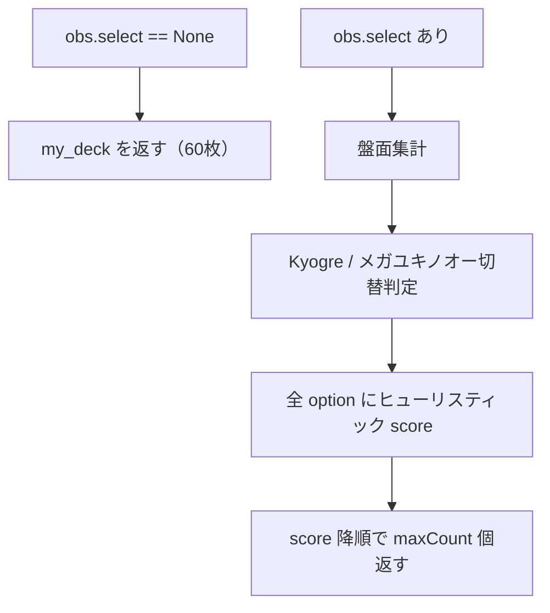
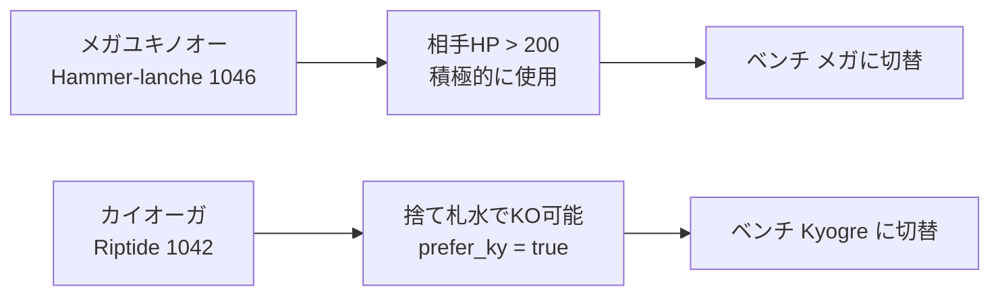

# Mega Abomasnow ex（ユキノオー）デッキ — 処理・戦略方針

現行エージェント [`agents/mega_abomasnow_ex.py`](../agents/mega_abomasnow_ex.py) とデッキ [`input/raw/decks/mega-abomasnow-ex/deck.csv`](../input/raw/decks/mega-abomasnow-ex/deck.csv) の調査まとめ。

## 1. 全体像



- **種別**: 公式サンプルの **ルールベース（貪欲スコアリング）** エージェント。MCTS / RL / Search API は未使用。
- **関連ファイル**:
  - エージェント: [`agents/mega_abomasnow_ex.py`](../agents/mega_abomasnow_ex.py)
  - デッキ: [`input/raw/decks/mega-abomasnow-ex/deck.csv`](../input/raw/decks/mega-abomasnow-ex/deck.csv)
  - 公式コンセプト: [`sample_code/mega-abomasnow-ex-deck.ipynb`](../sample_code/mega-abomasnow-ex-deck.ipynb)
  - 提出手順: [`submission_practice_abomasnow.md`](submission_practice_abomasnow.md)

---

## 2. デッキ構成（現状）

### 2.1 `deck.csv`（60枚）

| cardId | 枚数 | 定数名 | カード |
|--------|------|--------|--------|
| 721 | 2 | `Kyogre` | カイオーガ |
| 722 | 4 | `Snover` | ユキカブリ |
| 723 | 4 | `Mega_Abomasnow_ex` | メガユキノオー ex |
| 1121 | 4 | `Ultra_Ball` | ハイパーボール |
| 1126 | 1 | `Precious_Trolley` | 大切なキャリー |
| 1192 | 4 | `Carmine` | カルミネ |
| 1227 | 2 | `Lillie_Determination` | リーリエの決意 |
| 1262 | 2 | `Surfing_Beach` | サーフビーチ |
| 3 | 29 | `Basic_Water_Energy` | 基本水エネルギー |
| 1219 | 4 | `Team_Rockets_Petrel` | ロケット団のラムダ |
| 1134 | 4 | `Team_Rockets_Receiver` | ロケット団のレシーバー |

### 2.2 公式サンプルデッキとの差

公式 ipynb 版は **1219 / 1134 なし**、リーリエ ×4、サーフビーチ ×3、基本水 ×34。  
現行 `deck.csv` は pnote 寄りの構成（ラムダ・レシーバー各4枚、水29枚）。

---

## 3. エージェント処理フロー

### 3.1 初期化

1. `deck.csv` を読み込み `my_deck`（60 cardId）を構築
2. `all_card_data()` でカード DB を取得（`card_table` は定義されるが現ロジックでは未使用）

### 3.2 `agent(obs_dict)` 分岐

**初期選択** (`obs.select == None`):

- `my_deck` をそのまま返す（提出 tar 内の `deck.csv` が対戦デッキになる）

**通常ターン**:

1. `field_counts` / `hand_counts` / `discard_counts` を集計
2. ベンチから「即攻撃可能」ポケモンを検出:
   - `bench_attacker_index0`: メガユキノオー（エネルギー **2以上**）
   - `bench_attacker_index1`: カイオーガ（エネルギー **1以上**）
3. 相手アクティブ HP → **Kyogre 優先切替** を判定:

```python
prefer_ky = op_active_hp <= 20 * discard_counts[Basic_Water_Energy]
```

- 捨て札の基本水 1枚あたり Kyogre「Riptide」が +20 ダメージ
- 相手 HP が `20 × 捨て札水枚数` 以下なら Kyogre で KO 可能 → Kyogre に切替

4. アクティブ / ベンチの状況から `switch_index`（入れ替え先ベンチ index）を決定
5. `select.option` 全件に score を付け、**降順で `maxCount` 個** の index を返す

---

## 4. 戦略方針

### 4.1 デッキコンセプト

> **Hammer-lanche** を主軸に **大量の基本水エネルギー** で火力を確保。  
> **Kyogre** で捨て札の水を再利用。  
> **レシーバー ×4 + ラムダ ×4** で実質8枚のラムダライン（捨て札からラムダ再生含む）。  
> 水エネが多く手札が詰まりやすいため、不利時は **プレシャスキャリー / リーリエ / ゼイユ（カルミネ） / ラムダ / レシーバー** で手札を回す。

### 4.2 二刀流アタッカー



| 技 | attackId | スコアリング |
|----|----------|--------------|
| Riptide | 1042 | `1000 + 捨て札水×20 - 90` |
| Hammer-lanche | 1046 | 相手 HP ≤ 200 なら **-100**（オーバーキル回避）、それ以外 **+100** |

### 4.3 展開・エネ配分

- **進化 (`EVOLVE`)**: `10000 + 付きエネ数` → 最優先
- **ベンチ配置**: ユキカブリを先に、メガはユキカブリ＋手札メガが揃うと高得点
- **エネ付け (`ATTACH`)**: ベース 5000。Snover 1枚、メガ2枚、Kyogre 1枚までを暗黙に抑制
- **攻撃可能ベンチがいる場合**: アクティブへの追加エネ付けを優先（両アタッカー準備済みなら +200）

### 4.4 手札回し（`assess_hand_state`）

**手札不利 (`bad_hand`)** の例:

- 手札の水エネ ≥3、または手札5枚以上かつ水≥2
- ユキカブリ / メガユキノオー / カイオーガが未確保
- プレシャスキャリーが欲しい局面（手札に水ばかり、キーカード不足）
- イワパレス相手でカイオーガ未準備

**`should_draw`** = `bad_hand` かつ進化待ち（ユキカブリ＋手札メガ）でないとき。

| カード | 手札不利時 | 方針 |
|--------|-----------|------|
| Precious Trolley | 8800+ | 手札にあれば最優先級で使用 |
| Receiver | 9200 / 8600 / 7200+ | 捨て札ラムダ再生 > 他サポ再生 > 山札サーチ |
| Petrel (Lambda) | 8000+ | 山札からサポーターサーチ |
| Lillie | 7800+ | リフレッシュ |
| Carmine (ゼイユ) | 7600+ | リフレッシュ |
| Ultra Ball | 4800–5200+ | ポケモン不足時 |

進化待ちのターンではドローサポーターを抑制（進化優先）。

### 4.5 相手能力（イワパレス）

- **Surfing Beach (`ABILITY`)**: 切替が必要なとき score=2000（にげるより優先）
- **RETREAT**: `switch_index >= 0` のとき 1500、それ以外 -1
- **捨て札選択 (`DISCARD`)**: 基本水 +100、重複 +500、リーリエ -20、カルミネ/ラムダ/レシーバーは手札リーリエありなら +30

### 4.7 行動優先度（おおよそ）

```
EVOLVE (10000+) > PLAY 汎用 (10000) > ATTACH (5000前後) > ABILITY/RETREAT (1500–2000) > ATTACK (900–1100前後)
```

設計上は **展開・ドロー・エネ付けを攻撃より優先** する傾向。

---

## 5. 提出・実行

- 対戦時は tar 内 **`main.py` + `cg/` + `deck.csv`** が必要
- エージェントは **`deck.csv` 固定パス** で読み込み
- ローカルパッケージ: `python scripts/package_submission.py --agent mega-abomasnow-ex`

---

## 6. 改善余地

1. **Precious Trolley (1126)**: 定数のみで使用判断なし
2. **Hammer-lanche 最適化**: 山札6枚の水期待値を見ず、相手 HP のみで攻撃抑制
3. **Search API 未使用**: 1手先以降の読みはなく、同点スコア時は option 順序依存
4. **Receiver の細かい連携**: 捨て札のどのサポーターを再生するかまでは未モデル化
